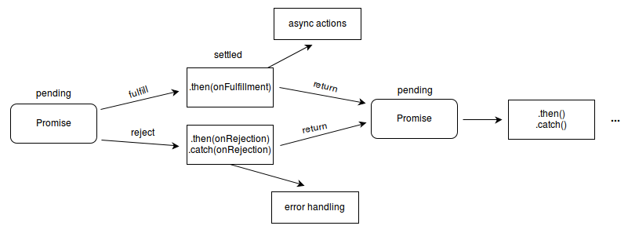

# 手动实现 Promise 并可以自定义

## 描述 定义

Promise 是异步编程新的解决方案

封装异步操作并可以获取结果

语法上来说就是一个构造函数

Promise 对象是一个代理对象（代理一个值），被代理的值在 Promise 对象创建时可能是未知的。



## why

### 指定回调函数的方式更加灵活

- 旧：必须在启动异步任务之前指定
- promise: 可以等到任务执行结束以后再指定
- 例子：网络请求 1 秒钟，我可以等到 5 秒以后再去拿返回的数据

### 支持链式调用，解决回调地狱问题

- 什么是回调地狱？
  - 回调函数嵌套调用
  - 而且是串联
  - 不方便阅读
  - dubug 异常处理很麻烦

```js
doSth1((r1) => {
  doSth2(
    r1,
    (r2) => {
      doSth3(
        r2,
        (r3) => {
          console("done");
        },
        failureCallack
      );
    },
    failureCallack
  );
}, failureCallack);
```

```js
doSth1()
  .then((r) => {
    return doSth2(r);
  })
  .then((r2) => {
    return doSth3(r2);
  })
  .then((r3) => {
    console("done");
  })
  .catch(failureCallack); //异常传透
```

### 终极解决回调地狱 async/await

```js
async function = await request(){
  try{
    const r1 = await getSth1();
    const r2 = await getSth2(r1);
    const r3 = await getSth2(r2);
  } catch (e){
    failureCallack(e);
  }
}
```
